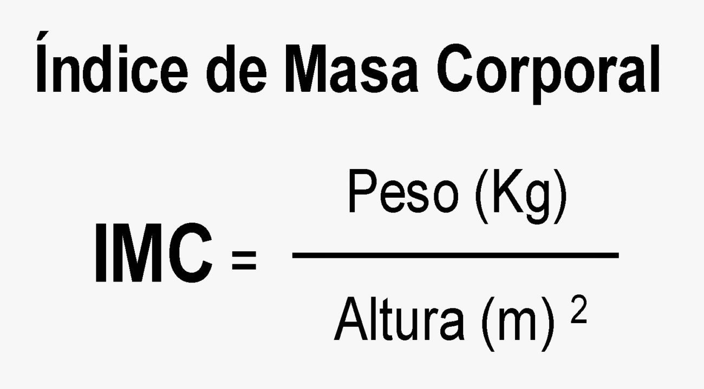
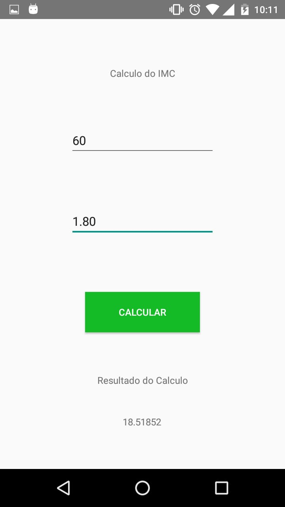

# Aplicação para cálculo do IMC

Aplicativo desenvolvido para obtenção de nota na matéria de <b>Programação de Aplicativos Mobile</b>, e tem como objetivo calcular o IMC de uma pessoa, é um app bem simples e não contem parâmetros como o de sexo ou estado físico da pessoa, mas de inicio na matéria de android, contém todo os requisitos necessários e pedidos pelo professor.

## O que é IMC?

Uma das maneiras de saber se o seu peso está adequado à sua altura é calculando o <b>Índice de Massa Corporal</b> (IMC). O resultado dessa fórmula matemática poderá indicar, por exemplo, se você está com peso adequado, se apresenta magreza, sobrepeso ou obesidade. Considere apenas como um ponto de partida, pois o IMC não avalia o seu estado nutricional como todo e precisa ser interpretado por um profissional de saúde, que analisará uma série de outras medidas e características suas, como idade, sexo, percentual de gordura, entre outros aspectos, antes de um diagnóstico.

A fórmula do IMC é a mesma para todas as pessoas. O que muda são os pontos de corte, ou seja, os valores considerados como referências para a classificação do seu peso. Essas referências são específicas para crianças, adolescentes, adultos, idosos e gestantes.

## Qual a formula?

## Interface:

### Tela 1

### Tela 2

